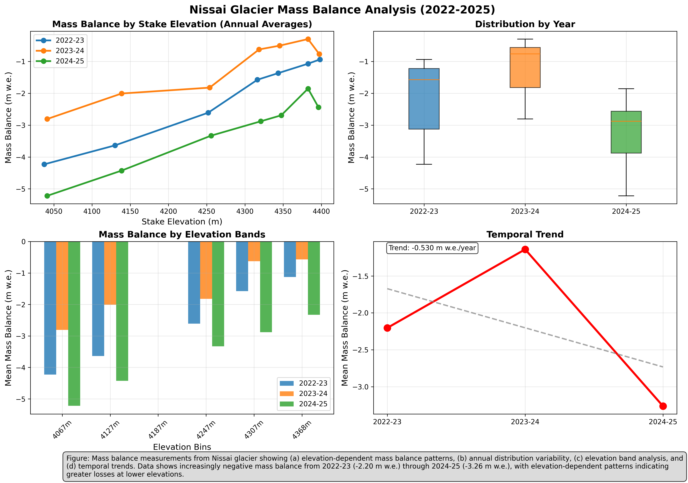

# Nissai Glacier Mass Balance Analysis

Analysis of glacier mass balance measurements from Nissai glacier (Pamir region) spanning 2022-2025.



## Overview

This project processes and visualizes mass balance data collected from 7 measurement stakes on Nissai glacier at elevations ranging from ~4,037m to ~4,398m.

**Key findings:**
- All measurements show negative mass balance (glacier retreat)
- 2022-23: Mean -2.20 m w.e.
- 2023-24: Mean -1.14 m w.e.
- 2024-25: Mean -3.26 m w.e.
- Overall trend: -0.53 m w.e./year

## Data

| File | Description |
|------|-------------|
| `nissai_mass_balance_final.csv` | Processed measurements (stake, elevation, mass balance, year) |
| `nissai_mass_balance_summary_final.csv` | Summary statistics by year |

## Scripts

| Script | Description |
|--------|-------------|
| `plot_mass_balance_simplified.py` | Generate 4-panel visualization |
| `process_mass_balance_final.py` | Full processing pipeline with 6-panel output |

## Usage

```bash
# Generate visualization
python plot_mass_balance_simplified.py
```

## Requirements

- Python 3
- pandas
- matplotlib
- numpy

## License

MIT
